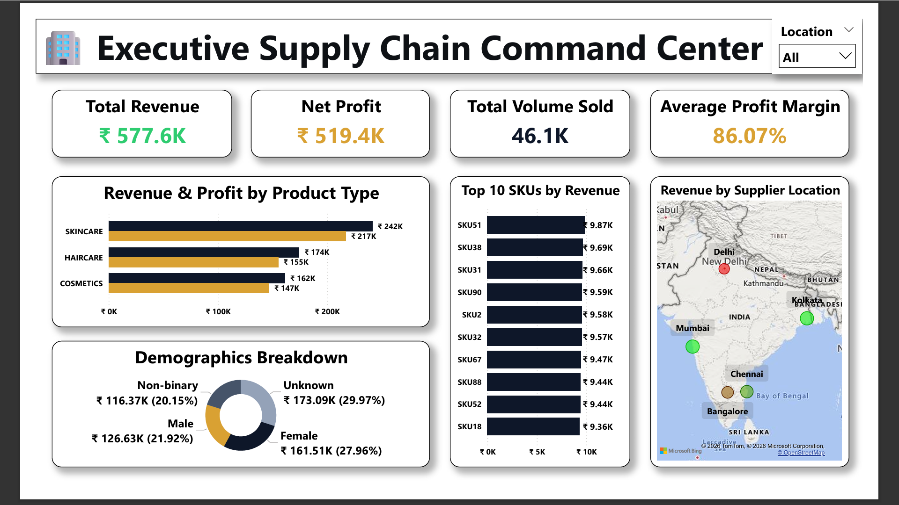
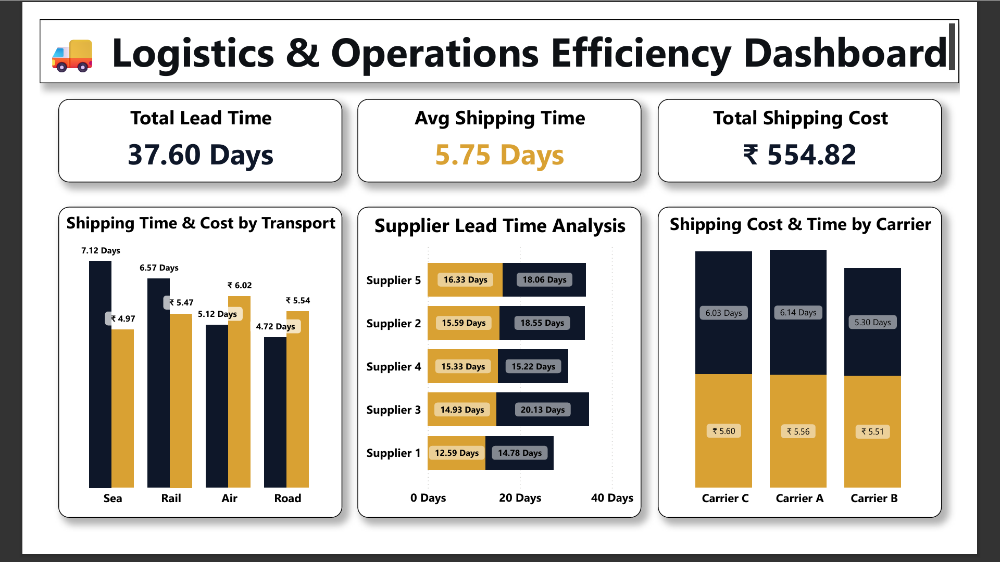
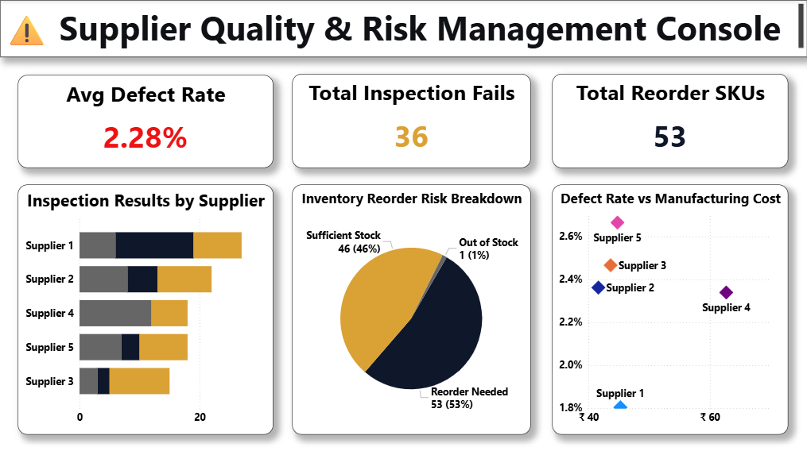

# 📦 End-to-End Supply Chain & Logistics Analytics

---

## 📌 Executive Summary

This enterprise-grade Supply Chain Analytics solution provides end-to-end visibility across financial performance, inventory risk, carrier logistics, and supplier quality management. Built upon an underlying dataset of **100 SKUs** generating **₹577.6K in revenue**, this 3-page interactive Power BI suite transforms raw operational data into actionable business strategies.

### 🔑 Key Executive Highlights
* **₹577.6K Total Revenue** generated with an outstanding **86.07% Average Profit Margin** (Net Profit: **₹519.4K**).
* **53% Inventory Deficit Risk:** Identified 53 out of 100 SKUs sitting below active order thresholds, creating fulfillment bottlenecks.
* **41% Inspection Backlog:** Highlighted critical operational friction with 41 SKUs pending quality checks, freezing active working capital.
* **Supplier Quality Crisis:** Exposed **Supplier 4** with a **66.7% inspection fail rate**, initiating vendor probation protocols.

---

## 📊 Dashboard Architecture & Screenshots

### Page 1: Executive Supply Chain Command Center
Focus: Revenue performance, category profitability, demographic demand distribution, and top-performing SKUs.

#### Key Insights & Findings:
1. **Skincare Dominance:** Skincare is the core revenue driver, contributing **₹242K (41.9%)** in revenue across **20K+ units sold**, outperforming Haircare (₹174K) and Cosmetics (₹162K).
2. **Balanced Demographics:** Customer purchasing is evenly split among Unknown (29.97%), Female (27.96%), Male (21.92%), and Non-binary (20.15%) customer groups.

---

### Page 2: Logistics & Operations Efficiency Dashboard
Focus: Transit time optimization, transport modal selection, carrier performance, and supplier lead-time breakdown.

#### Key Insights & Findings:
1. **Sea vs. Air Freight Cost Arbitrage:** Sea freight delivers optimal cost efficiency at **₹4.97 per unit** compared to **₹6.02 per unit** for Air freight (yeilding **17.4% unit cost savings**) with minimal delivery trade-offs for non-urgent shipments.
2. **Route Efficiency:** Rail Route B averages **6.57 days** at higher transit costs, whereas Road Route C cuts transit times to **3 days** at reduced cost.
3. **Supplier Lead Time Vulnerability:** Supplier 3 registers the longest average turnaround time (**20.13 lead days**), creating potential replenishment lags.

---

### Page 3: Supplier Quality & Risk Management Console
Focus: Defect rates, quality control pass/fail ratios, stockout risk distribution, and supplier unit economics.

 

#### Key Insights & Findings:
1. **Critical Quality Bottleneck:** 36 total inspection failures were recorded across all suppliers, with **Supplier 4 failing 2 out of 3 SKU inspections**.
2. **Defect Rates by Category:** Haircare exhibits the highest average product defect rate at **2.48%**, requiring upstream raw material audits.
3. **Inventory Reorder Risk:** 53% of SKUs require immediate reordering, 46% maintain sufficient stock, and 1% are actively out of stock.

---

## 💡 Strategic Recommendations & Action Plan

| Area | Operational Finding | Strategic Action Item | Expected Impact |
| :--- | :--- | :--- | :--- |
| **Warehouse Allocation** | Skincare generates 42% of revenue with 20K+ units. | Reallocate at least **45% of warehouse footprint** to Skincare SKUs and establish automated reorder triggers. | Prevents stockouts in primary revenue line. |
| **Supplier Risk** | Supplier 4 has a 66.7% quality failure rate and >15-day lead time. | Issue formal Corrective Action Request (CAR) and reassign 50% order volume to **Supplier 1** (lowest fail rate at 22%). | Reduces return costs & batch rejection rate. |
| **Quality Control** | 41 out of 100 SKUs stuck in "Pending" quality inspection status. | Onboard temporary QA staff/third-party inspectors to eliminate inspection backlog. | Unlocks frozen working capital and speeds time-to-market. |
| **Logistics Freight** | Air freight costs ₹6.02/unit vs ₹4.97/unit for Sea freight. | Shift all high-volume, routine restocks to Sea freight, reserving Air freight for emergency top-ups. | **17.4% reduction** in per-unit freight costs. |
| **Route Optimization** | Rail Route B takes 6.6 days vs 3 days on Road Route C. | Reroute regional shipments from Rail Route B to Road Route C. | Cuts regional transit time by **50%** and reduces freight spend. |

---

## 🛠️ Tech Stack & Workflow

* **Data Cleaning & Preprocessing (Microsoft Excel):** Structured, sanitized, and transformed raw telemetry using native Excel formulas, Power Query, and conditional formatting.
* **Data Modeling & Visualization (Power BI):** Designed a clean reporting interface leveraging native Power BI aggregation features, implicit measures, customized visuals, and interactive slicers.

---

## Author
Shridevi Kulkarni -[LinkedIn](https://www.linkedin.com/in/shridevi-kulkarni-data-analyst) - shrikulkarni142001@gmail.com
